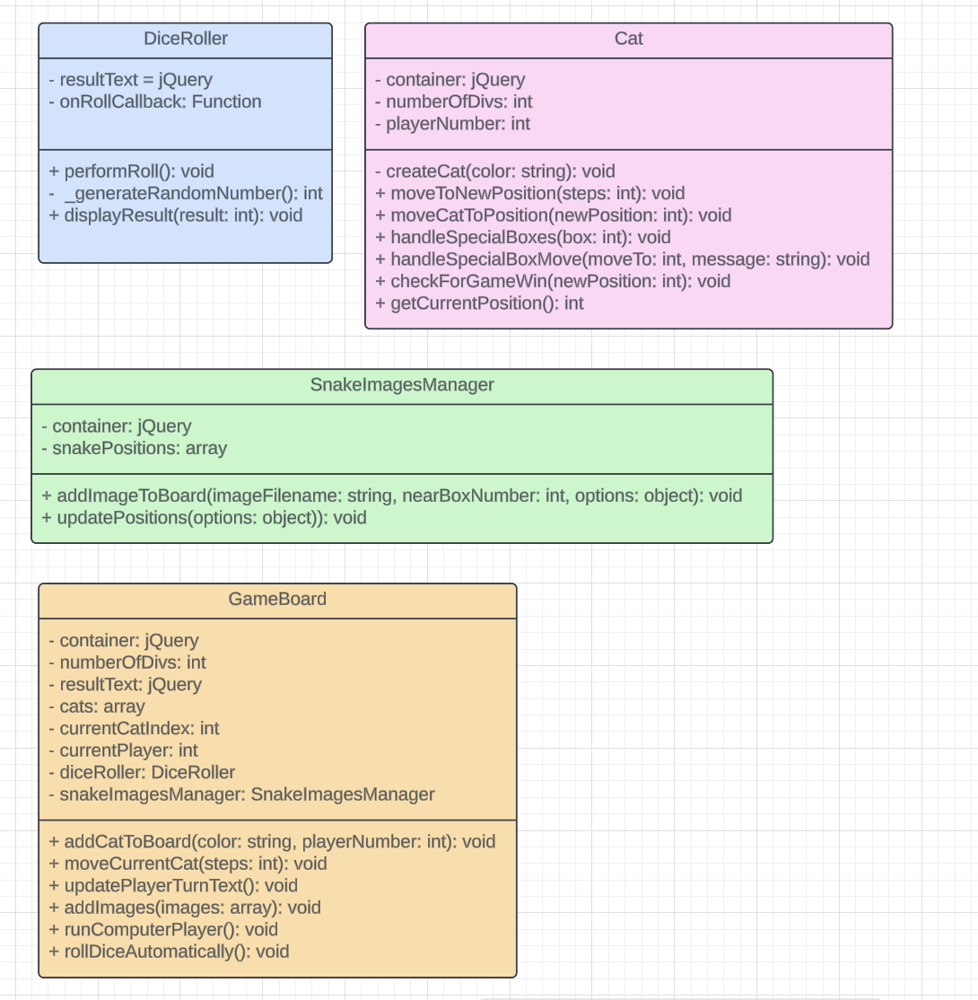

# Snakes and Ladders: Cat Edition -  Strings & Streams

I created a cat version of the popular game Snakes and Ladders for my assignment using HTML, CSS and mainly JavaScript.

## Table of Contents
1. [What is this game?](#what-is-this-game)
2. [POINT TO MENTION](#point-to-mention)
3. [How to play the game](#how-to-play-the-game)
4. [Challenge Outline](#challenge-outline)
   - [Summary and review of the problem, overall proposed solution](#summary-and-review-of-the-problem-overall-proposed-solution)
   - [UML Diagrams](#uml-diagrams)
   - [Initial working plan, overall approach, development strategy and approach to quality](#initial-working-plan-overall-approach-development-strategy-and-approach-to-quality)
   - [Analysis and decomposition of the overall problem into key ‘epic’ style tasks](#analysis-and-decomposition-of-the-overall-problem-into-key-epic-style-tasks)
   - [Initial object-oriented design ideas and planned phased breakdown into smaller tasks](#initial-object-oriented-design-ideas-and-planned-phased-breakdown-into-smaller-tasks)
5. [Development](#development)
   - [Adoption and use of ‘good’ standards](#adoption-and-use-of-good-standards)
   - [Ensuring quality through testing and resolving bugs](#ensuring-quality-through-testing-and-resolving-bugs)
   - [Reflection on key design challenges, innovations and how they were solved (with examples)](#reflection-on-key-design-challenges-innovations-and-how-they-were-solved-with-examples)
6. [How to Run the Project](#how-to-run-the-project)
7. [Evaluation](#evaluation)
   - [Analysis with embedded examples of key code refactoring, reuse, smells](#analysis-with-embedded-examples-of-key-code-refactoring-reuse-smells)
8. [Implementation and effective use of ‘advanced’ programming principles](#implementation-and-effective-use-of-advanced-programming-principles)
   - [Object-Oriented Programming (OOP)](#object-oriented-programming-oop)
   - [Features showcase and embedded innovations (with examples)](#features-showcase-and-embedded-innovations-with-examples)
9. [Reflective review, opportunities to improve and continued professional development](#reflective-review-opportunities-to-improve-and-continued-professional-development)
10. [Images used](#images-used)

## What is this game?
This game is a play on snakes and ladders but a cat version. Instead of tokens, it would be a cat. Instead of snakes, it would be a water stream because (most) cats hate water and instead of ladders, it would be string because cats love to play with strings.

## POINT TO MENTION
This game was built for my assignment, so I didn’t focus too much on responsive design as the main focus is the JavaScript code. If you make the screen smaller, the strings and streams may be out of place but just refresh your tab and it should be fine.

## How to play the game
[How to play snakes and ladders - general rules](https://learnenglishkids.britishcouncil.org/print-make/crafts/snakes-ladders) 
* A game board with numbered squares (usually 1 to 100).
* A six-sided die.
* Tokens or game pieces for each player.

Place all players' tokens on the starting square (usually 1).
Decide who goes first. This is done by whoever presses the "Roll Dice" button first

Gameplay:
Players take turns rolling the die and watching their tokens move forward the number of squares indicated by the die. If a player lands on the bottom of a ladder(string), they climb to the top of the ladder. If a player lands on the head of a snake(stream), they slide down to the tail of the snake.

Special Rules:
1. Ladders: When a player lands on the base of a ladder, they move their token to the top of that ladder.
2. Snakes: If a player lands on the head of a snake, they must move their token to the square at the tail of the snake.

Winning:
The winner is the first player to reach or exceed the final square (usually 100).

# Challenge Outline
## Summary and review of the problem, overall proposed solution
This game is a play on snakes and ladders but a cat version. Instead of tokens, it would be a cat. Instead of snakes, it would be a water stream because (most) cats hate water and instead of ladders, it would be string because cats love to play with strings. I propose to use HTML, CSS, and JavaScript. The game implements a turn-based system, dice rolling, and incorporates special actions.

## UML Diagrams

## Initial working plan, overall approach, development strategy and approach to quality
### Release Versions
**MVP/Alpha Release version 1** - your game is expected to support:
1. Design a basic game board with cells numbered from 1 to 100.
2. Represent cats as game pieces on the board.
3. Player info box where players can roll the dice and see the number
4. Introduce ladders represented by strings that elevate the cat to higher cells.
5. Implement water streams that act as snakes, causing the cat to descend to lower cells.
6. Implement dice rolling

Menu functionality
* One player
* Player VS Player

**MVP/Alpha Release version 2** – extend v1 so that your game also supports:
1. Display message after one player hits 100 and take them back to the menu
2. Add random events
3. Add a scoring system based on the least number of dice rolls and their name
4. Add an instruction pop-up on the menu page
5. Improve cat moving animation

Menu functionality
* Computer game run-through

**Beta/Release Candidate** – extended v2 so that your game also supports:
1. Display the player's turn
2. Ask the player for their name/s in the menu and display that in the turn message during the game instead of player1 and player2
3. Let the user choose which cat (optional)
4. Sound effects (optional)
5. Add fun facts at the end e.g. you rolled a 6 8 times (optional)

## Analysis and decomposition of the overall problem into key ‘epic’ style tasks
1. Game Board Setup: Initialise the game board, boxes, and players.
2. Dice Rolling Mechanism: Implement the dice roller and display results.
3. Player Cats: Create and move player cat instances.
4. Special Actions: Define actions for special boxes.
5. Game Logic: Manage turns, player wins, and game-end conditions.

## Initial object-oriented design ideas and planned phased breakdown into smaller tasks
#### Classes:
* GameBoard: Manage overall game logic.
* DiceRoller: Handle dice rolling and results.
* Cat: Represent player cats and their actions.

# Development
## Adoption and use of ‘good’ standards
Using an underscore (_) before a method or property name is a convention in JavaScript to indicate that it is intended to be private. In JavaScript, there is no strict enforcement of access control, so marking something as private is more of a convention for developers rather than a strict rule.

I marked a function, _generateRandomNumber as private to indicate that it's an internal method for the DiceRoller class, and it should not be called or accessed directly from outside the class. It's a way to signal to other developers (or myself) that this method is intended for internal use only, and external code should not rely on or call it.

I ensured consistent indentation and camelCase naming conventions across all scripts (HTML, CSS, and JavaScript).

## Ensuring quality through testing and resolving bugs
I conducted routine testing after each change and before merging my code, ensuring that any changes made were thoroughly examined to prevent potential code breaks.

There were instances when I made modifications and encountered bugs during the process. For instance, in the Computer VS Computer mode, the cats would autonomously move without the user clicking "Roll Dice," but users still had to dismiss notifications for special moves or when traversing strings and streams. This disrupted the intended automated experience. Additionally, the frequent need to close these notifications in other game modes became bothersome. Consequently, I revised the notification system: instead of using an alert that required user interaction, notifications now appear and automatically disappear after a few seconds. This made the game experience much more enjoyable. 

I identified and resolved another bug where, during the notification display, users could still click "Roll Dice" the cat would move, which was unintended. Upon noticing this issue, I modified the code. Now, when a notification is shown, users must wait until it disappears before they can roll the dice again. The dice functionality is disabled until the notification vanishes and the cat has completed its move. If users attempt to click it during this period, it won't trigger any movement or actions.

## Reflection on key design challenges, innovations and how they were solved (with examples)
#### Challenge 1: Dynamic Cat Movement
* Details: Enabling smooth and dynamic movement of player cats based on dice rolls.
* Solution: Introduced an async/await mechanism to create a sense of animation during cat movement, making the game visually engaging.

#### Challenge 2: Special Box Effects
*  Details: Handling diverse special box effects and providing user notifications.
* Solution: Implemented a notification system that displayed messages for each special box effect, enhancing user experience and understanding of game events.

#### Innovation 3: Notification System for Special Box Effects
* Details: Implemented a notification system to inform players of special box effects.
* Impact: Improved player engagement by providing clear and timely feedback on in-game events, making the gameplay more immersive.

## How to Run the Project
**If the link takes you to a game page with a board, click the MAIN MENU button to take you to the menu so you can select what type of game mode you want to play** 

* [You can use this link but if it doesn't work follow the steps below](https://isabellas2.github.io/Advanced-Programming-Game/) 
 
1. In the repository, click on **Settings** Tab at the top
2. Under **Code and Automation** to the left, click **Pages**
3. There you should see a link where the site is available

# Evaluation
## Analysis with embedded examples of key code refactoring, reuse, smells
The code exhibits good modularisation by encapsulating related functionality within classes (e.g., DiceRoller, Cat, GameBoard, SnakeImagesManager). The use of private methods (_generateRandomNumber, _handleSpecialBoxMove) enhances encapsulation. 

#### Code Refactoring
* Example: Refactored the movement logic in the Cat class to enhance readability and maintainability.
* Impact: Improved code maintainability and reduced the risk of introducing bugs during future modifications.

#### Code Reuse
* Example: Utilised the SnakeImagesManager class for both stream and string images, promoting modular code.
* Impact: Reduced redundancy, leading to a more maintainable and extensible codebase.

#### Code Smells:
* Example: Identified and addressed duplicated code segments such as repeated text within the special box effects implementation.
* Impact: Enhanced code consistency and readability, eliminating potential sources of error.

## Implementation and effective use of ‘advanced’ programming principles
### Object-Oriented Programming (OOP):

#### Effective Class Usage:
* OOP Connection: The effective usage of classes (DiceRoller, Cat, GameBoard, SnakeImagesManager) aligns with the point on effective class usage, providing a modular and organised structure.

#### Encapsulation:
* OOP Connection: The use of encapsulation and private methods within classes. 
* Example: methods like moveToNewPosition, moveCatToPosition, and handleSpecialBoxMove handle cat movements and special box interactions. Internal logic within these methods is encapsulated, allowing external entities to interact with the Cat class without needing to understand the intricate details.

#### Abstraction:
* OOP Connection: The use of abstraction through the encapsulation of complex processes within classes.
* Example: In the DiceRoller class, the method _generateRandomNumber() is hidden from external entities. Users interact with a simple performRoll() method without needing to know the underlying random number generation complexities.

#### Structural Clarity:
* OOP Connection: The use of classes contributes to structural clarity, aligning with the point about the modular approach and enhanced maintainability.
* Example: The GameBoard class segregates game logic, such as managing player turns and interactions, into distinct methods and properties. This modular approach ensures that each class has a specific responsibility, making the codebase organised and easier to navigate.

#### Scalability and Maintainability:
* OOP Connection: The principles of OOP contribute to scalability and maintainability, supporting the point about scalability and ease of maintenance through modular structures.
* Example: Adding a new feature, like introducing a new type of special box in the game, can be achieved by extending the existing Cat class methods or introducing a new subclass. This flexibility allows for easy modifications without disrupting existing functionalities, showcasing the scalability and maintainability benefits of OOP.

#### Foundation for Extensibility:
* OOP Connection: OOP provides a foundation for extensibility, aligning with the point about a foundation for extensibility and independent development/modification of classes.
* Example: The SnakeImagesManager class is designed with extensibility in mind. If the game requirements change to add more types of dynamic images or behaviors, the class structure allows for easy extension without modifying existing functionalities. This modular and extensible design demonstrates the foundational benefits of OOP for independent development and modification.

#### Event Handling:
* Effective use of event handling with jQuery for the "Roll Dice" button ($("#roll-dice-btn").on("click", ...)) and window resize ($(window).on("resize", ...)).

## Features showcase and embedded innovations (with examples) - opportunity to ‘highlight’ best bits
#### Special Boxes:
* Innovative implementation of special boxes (handleSpecialBoxes) with diverse effects on the game, enhancing gameplay variety.
* **OOP Connection:** The use of classes facilitates the innovative implementation of special boxes. Each special box type can be encapsulated within its own class, adhering to the principles of OOP by organising related functionality together.

#### Dynamic Image Placement:
* The SnakeImagesManager dynamically adds and updates positions of images based on game events, contributing to a visually engaging experience.
* **OOP Connection:** The SnakeImagesManager class exemplifies OOP principles by encapsulating the logic for dynamic image placement. Abstraction is evident as it abstracts away the complexities of image positioning, providing a clean interface for managing images dynamically.

## Reflective review, opportunities to improve and continued professional development
This project has been useful in helping me grow my skills in HTML, CSS, and JavaScript, which I've been actively learning as part of my professional development plan at work. Choosing to build the game as a website allowed me to leverage my comfort with the chosen languages and implement my ideas within the given timeframe. The development of this project significantly enhanced my JavaScript proficiency. I gained valuable insights into error handling, and the setTimeout function, and deepened my understanding of Object-Oriented Programming (OOP).
This project has been a valuable learning experience, providing insights into the intricacies of project development planning. I gained skills in breaking down tasks, both in terms of practical to-dos and code implementation, which proved beneficial throughout the project's development. Additionally, I learned how to create a Class Diagram, a concept that was new to me. Looking ahead, I am motivated to enhance my JavaScript skills, delving deeper into the concepts illuminated by this project and exploring more advanced aspects of the language.

## Images used
* [Purple Cat](https://www.flaticon.com/free-icon/black-cat_12403038) 
* [Grey Cat](https://www.flaticon.com/free-icon/cat_7187674) 
* [Blue Cat](https://www.flaticon.com/free-icon/cat_3629088) 
* [Orange Cat](https://www.flaticon.com/free-icon/cat_1864514) 
* [Black Cat](https://www.flaticon.com/free-icon/black-cat_12402429) 

I designed the strings and streams myself using Figma
